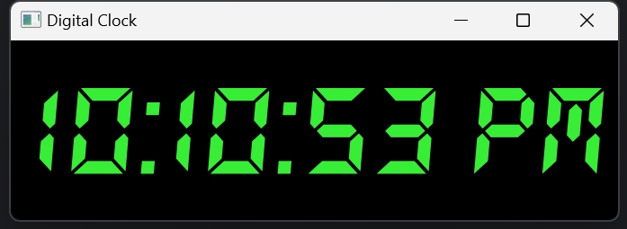

# 🕒 PyQt5 Digital Clock

This project is a **digital clock application** built with **Python and PyQt5**.  
It was created by following Bro Code's YouTube tutorial:  
📺 [Watch the tutorial here](https://youtu.be/ix9cRaBkVe0?si=X5F19dn2qrT9DV0L&t=37968)

## 🎯 Project Goals

- Review and refresh my **Python programming** skills
- Get familiar with building **desktop GUI applications**
- Learn and practice using the **PyQt5** framework

## 🖼️ Screenshot

*(Styled with a black background and green digits)*

## 🛠️ Features

- Real-time digital clock display
- Custom font styling (`DS-DIGIT.TTF`)
- 12-hour format with AM/PM display
- Styled with a black background and green digits

## 📦 Requirements

- Python 3.x
- PyQt5
